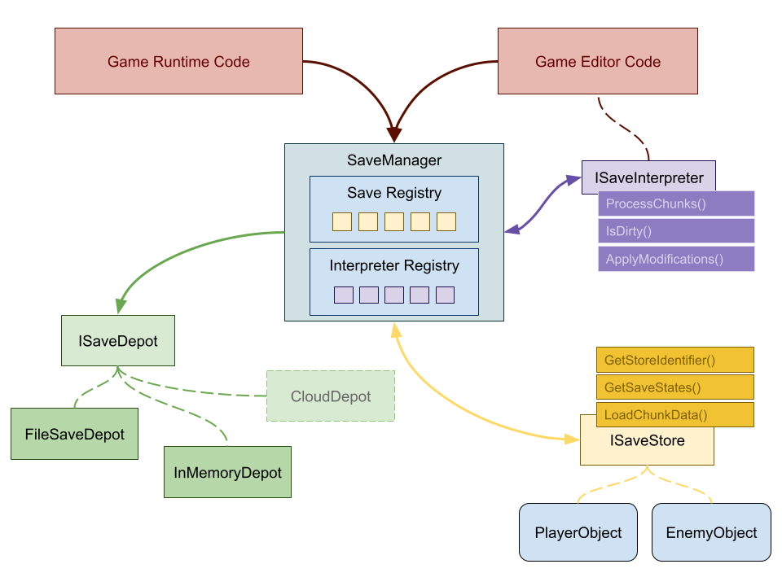

# Chonks.net
Chonks is a save system for dotnet based game engines (Unity3D, MonoGame)

## Installation

You can install chonks in your Unity3D project by following the steps in the [Chonks.Unity](./packages/Chonks.Unity#Readme) readme. We don't have a NuGet package yet, so you'll have to download the source to install Chonks in any other project for now.

## System Design




### System Components

| Component Name      | Description                                                                                                          |
|---------------------|----------------------------------------------------------------------------------------------------------------------|
| **SaveDepot**       | Depots are objects that manage persistent storage of the chunks. There could be a FileSaveDepot, CloudSaveDepot, DatabaseSaveDepot, etc. |
| **SaveStore**       | Stores are objects that need to save data and respond to save data being loaded in. |
| **SaveInterpreter** | Any objects that may need to present chunk data should be interpreters. Interpreters can also modify chunk data before it is saved. These are intended to be used as editor hooks for whatever engine you're implementing Chonks in. |
| **SaveManager**     | The SaveManager handles the logic around creating, applying and loading snapshots (might be better called a SnapshotManager... hmmm maybe). Think of this as the main interaction point your game code has with Chonks. |
| **Registry**        | Registries are basic wrappers around lists that expose an event for when new items are registered. |


## Creating release notes

First, you'll need [gitmoji-changelog](https://github.com/frinyvonnick/gitmoji-changelog) installed.

```
$ npm install -g gitmoji-changelog
```

After that is installed you can run `gitmoji-changelog --preset generic` to generate the updates to the [CHANGELOG.md](./CHANGELOG.md) and push your new version.